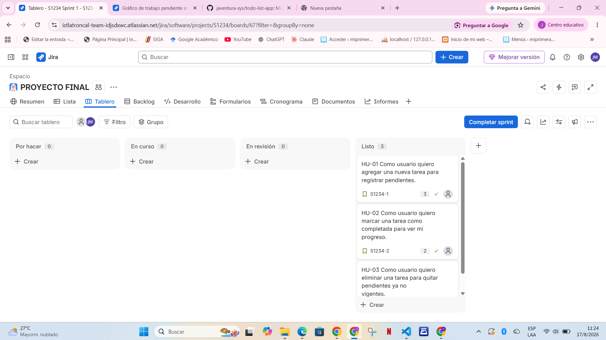
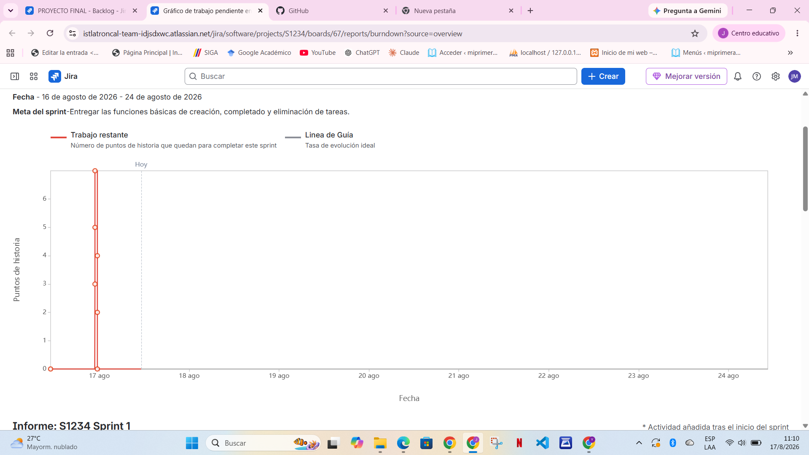

# Mini Lista de Tareas (To-Do List)

Proyecto Final - Unidad 4: Aplicación de metodología de desarrollo según tendencia
Metodología de Desarrollo de Software (DAWA-202) - ISTLT

## Descripción

Aplicación web sencilla de lista de tareas (HTML, CSS y JavaScript puro) desarrollada 
aplicando el ciclo completo de SCRUM: Product Backlog, Sprint Planning, Sprint, Daily Scrum, 
Sprint Review y Retrospective.

## Historias de usuario implementadas (Sprint 1)

| ID | Historia de Usuario | Prioridad | Puntos | Estado |
|----|---------------------|-----------|--------|--------|
| HU-01 | Como usuario quiero agregar una nueva tarea para registrar pendientes. | Alta | 3 | Listo |
| HU-02 | Como usuario quiero marcar una tarea como completada para ver mi progreso. | Alta | 2 | Listo |
| HU-03 | Como usuario quiero eliminar una tarea para quitar pendientes ya no vigentes. | Alta | 2 | Listo |

Historias pendientes para un futuro Sprint 2: HU-04 (editar tarea) y HU-05 (filtrar tareas).

## Herramientas utilizadas

- **Jira**: Product Backlog, Sprint Planning, tablero SCRUM, Burndown Chart
- **GitHub**: control de versiones (commits por historia de usuario)
- **GitHub Actions**: integración continua (CI)
- **VS Code**: desarrollo del código

## Tablero SCRUM final

## Burndown Chart

### Interpretación del Burndown Chart

El avance real estuvo muy por encima de la línea ideal: las 7 historias de puntos se 
completaron el primer día del sprint (16 de agosto), en lugar de distribuirse a lo largo 
de los 8 días planificados. Esto se debió a que el desarrollo se realizó en una sola sesión 
de trabajo concentrada, en vez de repartir el esfuerzo día a día como simula un equipo real. 
No hubo días sin avance porque no se dejó tiempo entre sesiones.

## Sprint Review

- ¿Las historias HU-01, HU-02 y HU-03 funcionan correctamente en el navegador? Sí, se probaron 
todas las funciones (agregar, marcar como completada, eliminar) y funcionan sin errores.
- ¿El código está subido a GitHub con commits por historia? Sí, cada historia tiene su propio 
commit descriptivo en el repositorio.
- ¿El pipeline de integración continua se ejecutó sin errores? Sí, el workflow "CI Básico" en 
GitHub Actions se ejecutó correctamente, verificando que los 3 archivos requeridos existen.

## Sprint Retrospective

**Start (empezar a hacer):** Incorporar la práctica de hacer commits más pequeños y frecuentes 
a medida que se programa cada función, en vez de subir todo el código de una sola vez.

**Stop (dejar de hacer):** Evitar dejar la configuración inicial de herramientas (Jira, GitHub) 
para el mismo día que se empieza a programar, ya que consume tiempo que podría usarse en el 
desarrollo.

**Continue (seguir haciendo):** Seguir probando cada funcionalidad en el navegador antes de 
moverla a "Listo" en el tablero, ya que esto ayuda a detectar errores a tiempo.